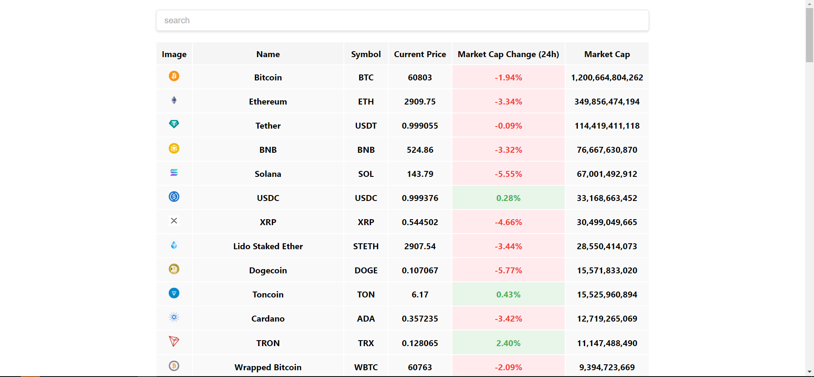

# پروژه قیمت ارزهای دیجیتال به صورت آنلاین

این پروژه یک وب‌سایت ساده برای مشاهده قیمت ارزهای دیجیتال به صورت آنلاین است. شما می‌توانید قیمت ارزهای مختلف را به صورت لحظه‌ای مشاهده کنید و از تغییرات آنها مطلع شوید.

## ویژگی‌ها

- مشاهده قیمت لحظه‌ای ارزهای دیجیتال
- قابلیت سرچ ارز دلخواه
- رابط کاربری ساده و کاربرپسند
- استفاده از API برای دریافت اطلاعات قیمت

## تصویر پروژه



## نصب و راه‌اندازی

برای اجرای این پروژه، مراحل زیر را دنبال کنید:

1. ابتدا مخزن را کلون کنید:
    ```bash
    git clone https://github.com/maswd/CryptoPriceTracker.git
    ```

2. وارد پوشه پروژه شوید:
    ```bash
    cd CryptoPriceTracker
    ```

3. وابستگی‌ها را نصب کنید:
    ```bash
    npm install
    ```

4. پروژه را اجرا کنید:
    ```bash
    npm start
    ```

## استفاده از API

برای دریافت قیمت ارزهای دیجیتال، این پروژه از یک API عمومی استفاده می‌کند. شما می‌توانید API دلخواه خود را در فایل پیکربندی پروژه تنظیم کنید.

## مشارکت

ما از مشارکت‌های شما استقبال می‌کنیم! لطفاً برای مشارکت در این پروژه مراحل زیر را دنبال کنید:

1. مخزن را فورک کنید
2. شاخه‌ای برای ویژگی جدید یا رفع اشکال ایجاد کنید (`git checkout -b feature/NewFeature`)
3. تغییرات خود را کامیت کنید (`git commit -m 'Add some NewFeature'`)
4. شاخه خود را پوش کنید (`git push origin feature/NewFeature`)
5. درخواست مرج دهید

## مجوز

این پروژه تحت مجوز MIT منتشر شده است. برای اطلاعات بیشتر فایل LICENSE را مشاهده کنید.

## تماس با ما

اگر سوالی دارید یا نیاز به پشتیبانی دارید، لطفاً با ما تماس بگیرید:

- ایمیل: alone.3303@gmail.com
- تلگرام: [maswd13](https://t.me/maswd13)

---

متشکریم که از پروژه ما استفاده می‌کنید!
